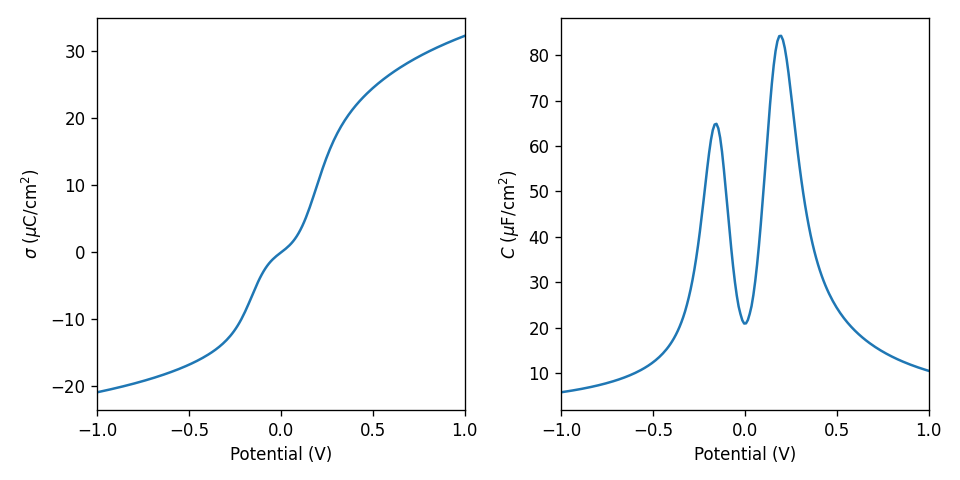
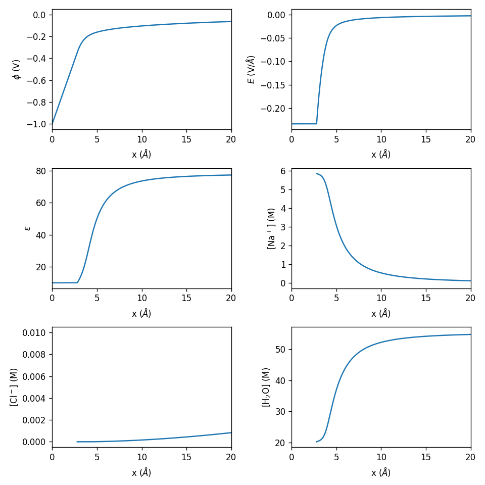

# Frumkin

_Alexander Frumkin was a Soviet Russian electrochemist, famous for his contributions to the understanding of the relationship between kinetics and the electric double layer structure._

This repository contains code for modelling the electric double layer (in absence of chemisorption) using modified Poisson-Boltzmann theory. The theory is largely based on the work of [Iglič, Gongadze, and Kralj-Iglič (2019)](https://physics.fe.uni-lj.si/publications/pdf/Iglic_et_al_PRINTED_Acta_Chim_Slov_2019.pdf). The code is intended to be easy to use, with out-of-the-box plotting functions, for easy comparison to experimental capacitance data.

## Minimal example

First, we need to define an electrolyte. We specify a list of solvents and ions. Water has been implemented out-of-the-box, and has size parameter 1. The ions have sizes 6 and 2, respectively. The size parameter specifies the size of species relative to the lattice spacing. The lattice spacing is defined here such that if all lattice sites are occupied by water molecules, their density equals the water density at room temperature.

```python
from frumkin.electrolyte import LatticeElectrolyte, Ion, Water
conc = 1e-2  # molar concentration
el = LatticeElectrolyte([
    Water(),
    Ion(name=r"Na$^+$", size=6, concentration=conc, charge=+1),
    Ion(name=r"Cl$^-$", size=2, concentration=conc, charge=-1),
])
```

For implementing other solvents look at the definition of the `Solvent` class in `frumkin/electrolyte.py`.

Next, we set up the model:

```python
from frumkin.gongadze_iglic import GongadzeIglic
model = GongadzeIglic(el, ohp=2.8)
```

The `ohp` (outer Helmholtz plane) parameter specifies the distance of closest approach for ions in Angstrom. If it is not specified, the model will calculate `ohp` as half the size of a counterion (positive ions if the surface is negatively charged and vice versa).

It is also possible to specify the permittivity in the Stern layer to a fixed value with the `eps_stern` parameter. If it is not specified, the permittivity depends on the local electric field.

Given an array of potentials w.r.t the potential of zero charge, we can run a voltammetry experiment and plot the resulting surface charge and capacitance:
```python
import numpy as np
potential = np.linspace(-1, 1, 200)
result = model.voltammetry(potential)
f = result.plot()
```
(the `f=` is necessary in notebooks to not get double figures).



We can also show the spatial profiles of the double layer at a fixed potential, defined in volts w.r.t. the point of zero charge:

```python
profiles = model.single_point(potential=-1)
f2 = profiles.plot()
```



For more examples, see the `examples` folder.

## Nondimensionalization

* The standard unit of length is Angstrom ($\mathrm{\AA}$) and the standard unit of energy is electronvolt (eV).
* The second-order Poisson-Boltzmann equation has been rewritten into a system of two first-order equations (the derivation was rather involved and was checked with Wolfram Mathematica; it still needs to be written out at some point). A starting point for redoing this process with SymPy can be found in `solving.ipynb`.

## Further reading
Further theoretical background on modified Poisson-Boltzmann models:

* Introduction to the lattice-gas approach for deriving modified Poisson-Boltzmann equations: [Borukhov, Andelman and Orland (2000)](https://doi.org/10.1016/S0013-4686(00)00576-4).
* Treatment of asymmetric ion sizes on a fixed lattice: [Zhang and Huang (2018)](https://doi.org/10.1021/acs.jpcc.8b08298).
* Including dipoles in a lattice description: [Abrashkin, Andelman and Orland (2007)](https://doi.org/10.1103/PhysRevLett.99.077801).
* Density-potential functional theory of electric double layers, field theory perspective: [Huang (2021)](https://doi.org/10.1016/j.electacta.2021.138720).

## Development
In the future it would be interesting to add orbital-free density functional theory, [chemisorption](https://doi.org/10.1103/PRXEnergy.3.043008), and [solvent structure](https://doi.org/10.1103/PhysRevApplied.23.024009).


It might be good to upgrade the solver from SciPy's `solve_bvp` to a finite element solver like FEniCS. Such a solver has already been implemented for Poisson-Nernst-Planck models in the [electrochemistry module](https://libatoms.github.io/matscipy/applications/electrochemistry_2.html) of `matscipy`.


## Papers that used Frumkin

* The branch `her-paper` contains the code that was used to produce the results in the paper: [De Kam, L. B. T., Maier, T. L., & Krischer, K. (2024). Electrolyte effects on the alkaline hydrogen evolution reaction: a mean-field approach. _Electrochimica Acta_, 144530.](https://doi.org/10.1016/j.electacta.2024.144530)

* The branch `nanostructure-paper` contains the code for the following paper: [Maier, T. L., T. De Kam, L. B. T., Golibrzuch, M., Angerer, T., Becherer, M., & Krischer, K. (2024). How Metal/Insulator Interfaces Enable an Enhancement of the Hydrogen Evolution Reaction Kinetics. _ChemElectroChem_, e202400109.](https://doi.org/10.1002/celc.202400109)
